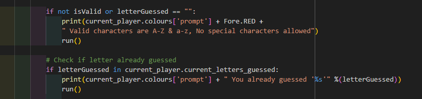
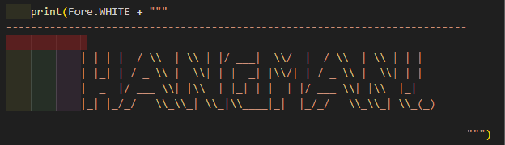

# HANGMAN!!!

*The link to [Hangman!](https://hang-man888-99eb4815e363.herokuapp.com/)*

Hangman is a Python terminal project whose primary purpose is to boost users' moods and provide entertainment, challenges and fun.

Users can quickly learn the rules of the game and then play along following the terminal prompts. Guess a letter, and try to make sure that man doesnt hang!

---

## How to play:

  1. Click this *[link](https://hang-man888-99eb4815e363.herokuapp.com/)* or copy this text: https://hang-man888-99eb4815e363.herokuapp.com/ and paste it in your browser's address bar.

  2. As soon as the page is loaded, click 'RUN PROGRAM'.

  3. Select an option from the main menu.

  4. Learn the rules if needed.

  5. You can add multiplayer if desired once you press play game, you will be prompted to enter how many players you want to play with (max 3).

  6. You will then be asked to add each players name 1 by 1. 

  7. A word is selected from an imported word bank of approximatley 2000 words. 

  8. Look at how long your word to guess is and start thinking about what it could be. Add your letter guesses when prompted. If you chose to play multiplayer, each player will take it in turns to guess a letter and each players guesses will be displayed when it is their turn.

  9. As you add each letter it will either appear and take the place of a blank soace in the word, or it will add another part onto the hangman.

  10. You have 9 wrong attempts to guess the word before the hanging takes place!

  11. If you fail and get it wrong, the full hangman is displayed and "game over!" is printed, and the word you were trying to guess is revealed.

  12. If you successfully guess the word, congratulations, you win!!!! The main menu pops up, and you can either choose to play again or leave the game.

  Link to the game:(https://hang-man888-99eb4815e363.herokuapp.com/)*

---
## User Stories
### First Time Visitor Goals:

* As a First Time Visitor, I want to quickly understand the program's primary purpose so that I can learn more about this program.

* As a First Time Visitor, I want to navigate through the program easily so that I can find the content.

* As a First Time Visitor, I want to find the program useful for myself so that I can fulfill my expectations and have fun.

* As a First Time Visitor, I want to see different text colors so it looks more enticing, and the different parts of the game are easily distinguishable.

### Frequent Visitor Goals:

* As a Frequent User, I want to be able to play as many times as I like and not worry about a word being repeated, variation is key in this game.
* As a Frequent User, I will want to explore the other game option, multiplayer.

---

## Features
  
  - **When the program is loaded**

  - The user can see a title using Ascii art, "HANGMAN!" a menu appears and asks for the users input for menu selection.

  - **When the user selects a menu option**

  - Shows the terminal menu with three options:

    1. Play Game;

    2. Rules;

    3. Exit Game;

  The user can enters a number into the terminal in relation to which menu option they wish to select.

  - **When the user chose "Rules"**

  The user will see the main rules of the game which are required to be followed.
  Below the rules, the user can find the main menu where they may choose another option.

  

  - **When the user choose's "Play Game"**
  
  1. The game will ask how many players and the names, then will start to run;

  2. Keep adding letters as your guesses until you guess the word, or you "hangman!"

  3. Special characters and numbers are not allowed to be used, and will be greeted with an error message telling the user to select another option.

  

  - **When the user chose "Quit"**

  The user will see a goodbye message, and the program will be stopped.

  

---

## Flowchart

The flowchart represents the logic of the application:

  

---

## Technologies Used

### Languages:

- [Python 3.8.5](https://www.python.org/downloads/release/python-385/): used to anchor the project and direct all application behavior

- [JavaScript](https://www.javascript.com/): used to provide the start script needed to run the Code Institute mock terminal in the browser

- [HTML](https://developer.mozilla.org/en-US/docs/Web/HTML) used to construct the elements involved in building the mock terminal in the browser

### Frameworks/Libraries, Programmes and Tools:

#### Python modules/packages:

##### Standard library imports:

- [random](https://docs.python.org/3/library/random.html) was used to implement pseudo-random word selection from word bank.
- [os](https://docs.python.org/3/library/os.html ) was used to clear the terminal before running the program.???????????????

##### Third-party imports:

- [Random Lists](https://www.randomlists.com/data/words.json) Word bank used for word pool for the game.
- [Colorama](https://pypi.org/project/colorama/) was used to add colors and styles to the project.
- [os, random, string](????)????

#### Other tools:

- [VSCode](https://code.visualstudio.com/) was used as the main tool to write and edit code.
- [Git](https://git-scm.com/) was used for the version control of the website.
- [GitHub](https://github.com/) was used to host the code of the website.
- [Techsini](https://techsini.com/) used to create the head mock up picture for the readme.
- [Miro](https://miro.com/app/dashboard/) was used to make a flowchart for project planning and the README file.

---

## Bugs

+ **Solved bugs**

1. Special characters and numbers were being read and allowed by the program including blank and white spaces and repeated letter guesses.

*Solution:* 

- I defined a function that checked for "invalid chars" and provided a print statement saying "Valid characters are A-Z & a-z" if one is used.

#### This shows the game restarting if a blank space was entered into input prompt.

#### The next screen shots show the code added to prevent this happening.

2. The counter wasnt working, and a piece of the hangman was being added each time a letter was guessed, even if it was correctly part of the word.

*Solution:* 

- Added counter "rightLetters += 1" as it wasnt there the count wasnt being updated and stayed at 0.

3. Invalid escape sequence, syntax warning. characters being used for the hangman visual and welcome game title.

*Solution:*

- Backslash was used in many places, as its an escape sequence it was showing an error, I had to double all backslashes used to remove the error message.

4. Main not being defined when you try to exit the game. 

*Solution:* 

- Indentation mistake.

5. if you press enter without any input in "guess a letter" input, it resets the game and picks a new random word.

*Solution:*

- Added player.pop(p) to reset loop and clear data.

6. Heroku error. Issue getting my project to deploy when first using heroku. 

*Solution:*

- Had to add in nodejs buildpack into my heroku files.

7. Multiplayer game loop not getting restarted at the end of each game. this was due to run() being wrongly indented.

## Testing

- Testing was carried out using the CI Linter check web page [CI Linter Validation](https://pep8ci.herokuapp.com/#)

## Deployment

- The program was deployed to [Heroku](https://dashboard.heroku.com).
- The program can be reached by the [link](https://hang-man888-99eb4815e363.herokuapp.com/)

### To deploy the project as an application that can be **run locally**:

*Note:*
  1. This project requires you to have Python installed on your local PC:
  - `sudo apt install python3`

  2. You will also need pip installed to allow the installation of modules the application uses.
  - `sudo apt install python3-pip`

Create a local copy of the GitHub repository by following one of the two processes below:

- Download ZIP file:
  1. Go to the [GitHub Repo page](https://github.com/Joeski88/hang_man)
  2. Click the Code button and download the ZIP file containing the project.
  3. Extract the ZIP file to a location on your PC.

- Clone the repository:
  1. Open a folder on your computer with the terminal.
  2. Run the following command
  - `git clone https://github.com/Joeski88/hang_man`

- Alternatively, if using Gitpod, you can click below to create your own workspace using this repository.

  

  1. Install Python module dependencies:
     
      1. Navigate to the folder madlib_with_python by executing the command:
      - `cd hang_man` !!!!!!!!!!!!!!!!!!!!!!!!!!!!!!!!!!!!!!!!!!!!!!!
      2. Run the command pip install -r requirements.txt
        - `pip3 install -r requirements.txt`
      3. *Note:* If you are located in China or any other country with restricted internet access, you may need to add the following code in order to be able to use the nltk package.
        - To set the proxy, you need to open setting in preferred VPN, find Server address and HTTP/HTTPS Proxy Port joining them by colons as it is shown in the example above:
      ????????????????????????????????????????

### To deploy the project to Heroku so it can be run as a remote web application:
- Clone the repository:
  1. Open a folder on your computer with the terminal.
  2. Run the following command
    - `git clone https://github.com/Joeski88/hang_man.git`
  3. Create your own GitHub repository to host the code.
  4. Run the command `git remote set-url origin <Your GitHub Repo Path>` to set the remote repository location to your repository.
  5. Push the files to your repository with the following command:
    - `git push`
  6. Create a Heroku account if you don't already have one here [Heroku](https://dashboard.heroku.com).
  7. Create a new Heroku application on the following page here [New Heroku App](https://dashboard.heroku.com/apps):
  8. Go to the Deploy tab.
  9. Link your GitHub account and connect the application to the repository you created.
  10. Go to the Settings tab.
  11. Click "Add buildpack".
  12. Add the Python and Node.js buildpacks in the following order.
  13. Click "Reveal Config Vars."
  14. Add 1 new Config Vars:
      - Key: PORT Value: 8000
      - *This Config was provided by [CODE INSTITUTE](https://codeinstitute.net/)*.
  15. Go back to the Deploy tab.
  16. Click "Deploy Branch".
        - Wait for the completion of the deployment.
  17. Click "Open app" to launch the application inside a web page.

## Credits

- Color formatting: [Colorama](https://pypi.org/project/colorama/).
- Random Lists & word banks: [randomlists](https://www.randomlists.com/) This page provided me with a random list of words from the english language to add to words.py.
- YouTube [youtube.com](https://www.youtube.com/watch?v=8ext9G7xspg&t=5790s) This tutorial showed me the basic logic of making a terminal based hangman python game.

## Acknowledgements
- My Mentor Iuliia Konovalova. I had issues with the help i was recieving with my previous mentor, 
  but i noticed a huge difference with the way Julia spoke to me and how she managed my situation, 
  she deserves alot of credit and praise for how she dealt with it. 